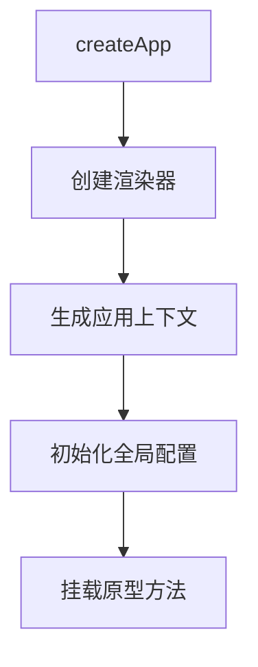

## 一、架构革命：从「单体Vue」到「应用工厂」

### 1.1 Vue2 的架构缺陷

```javascript
// Vue2 的全局污染问题
Vue.component('comp', {...}) // 影响所有实例
Vue.directive('dir', {...})
const vm1 = new Vue({...})
const vm2 = new Vue({...}) // 共享全局配置
```
### 1.2 Vue3 的核心突破

```ts
// 应用实例隔离
const app1 = createApp(Root1)
app1.component('Comp', {...}) // 仅作用于 app1

const app2 = createApp(Root2)
app2.directive('dir', {...}) // 仅作用于 app2
```
### 1.3 设计哲学转变

- **沙箱化**：每个应用都是独立宇宙
    
- **可测试性**：应用实例可独立销毁重建
    
- **微前端友好**：多实例共存不冲突

## 二、源码级执行流程（v3.4+ 最新实现）

### 2.1 核心调用链

复制

createApp()
├─ ensureRenderer()              // 延迟创建渲染器
│  ├─ createHydrationRenderer()  // 同构渲染
│  └─ createRenderer()           // 核心渲染器工厂
├─ createAppAPI()                // 应用方法构造器
└─ mount()                       // 量子化挂载过程

### 2.2 深度源码拆解

```ts
// packages/runtime-dom/src/index.ts
const createApp = ((...args) => {
  const app = ensureRenderer().createApp(...args)
  
  // 劫持 mount 方法实现浏览器环境适配
  const { mount } = app
  app.mount = (containerOrSelector: Element | string): any => {
    const container = normalizeContainer(containerOrSelector)
    if (!container) return
    
    const component = app._component
    component.render = component.render || NOOP
    
    // 执行清洁操作（移除SSR遗留内容）
    container.innerHTML = ''
    
    const proxy = mount(container, false, container instanceof SVGElement)
    if (container instanceof Element) {
      container.removeAttribute('v-cloak')
      container.setAttribute('data-v-app', '')
    }
    return proxy
  }

  return app
}) as CreateAppFunction<Element>
```
### 2.3 渲染器创建流程（核心理念）

```ts
// packages/runtime-core/src/renderer.ts
function createRenderer(options: RendererOptions) {
  const {
    insert: hostInsert,
    remove: hostRemove,
    patchProp: hostPatchProp,
    createElement: hostCreateElement,
    // ...共17个平台相关方法
  } = options

  // 核心渲染算法（Diff + Patch）
  const render = (vnode: VNode | null, container: RendererElement) => {
    if (vnode == null) {
      if (container._vnode) {
        unmount(container._vnode, null, null, true)
      }
    } else {
      patch(container._vnode || null, vnode, container)
    }
    container._vnode = vnode
  }

  return {
    render,
    createApp: createAppAPI(render)
  }
}
```
## 三、应用实例生命周期全解析

### 3.1 实例化阶段


### 3.2 挂载阶段
```ts
interface App<HostElement = any> {
  mount(
    rootContainer: HostElement | string,
    isHydrate?: boolean,
    isSVG?: boolean
  ): ComponentPublicInstance
  // 方法调用链：
  // 1. 标准化容器
  // 2. 创建VNode
  // 3. 执行render()
  // 4. 触发beforeMount
  // 5. 激活响应式系统
  // 6. 触发mounted
}
```
### 3.3 卸载阶段
```js
// 手动卸载应用实例
const app = createApp(App)
app.mount('#app')

// 触发卸载流程
app.unmount() 
// 调用链：
// 1. 触发beforeUnmount
// 2. 递归卸载子组件
// 3. 移除DOM事件监听器
// 4. 断开响应式绑定
// 5. 触发unmounted
// 6. 释放内存引用
```
## 四、核心设计模式解析
### 4.1 依赖注入系统

```ts
// 应用级 provide
interface App {
  provide<T>(key: InjectionKey<T> | string, value: T): this
}

// 实现原理：
const app = {
  _context: {
    provides: Object.create(null),
    components: {},
    directives: {},
    // ...
  }
}

function provide(key, value) {
  this._context.provides[key] = value
  return this
}
```
### 4.2 插件系统实现
```ts
// 插件安装过程
function use(plugin: Plugin, ...options: any[]) {
  if (installedPlugins.has(plugin)) {
    __DEV__ && warn(`Plugin already applied.`)
  } else if (plugin && isFunction(plugin.install)) {
    installedPlugins.add(plugin)
    plugin.install(app, ...options)
  } else if (isFunction(plugin)) {
    installedPlugins.add(plugin)
    plugin(app, ...options)
  }
  return app
}
```
### 4.3 组件注册机制
```ts
// 全局组件存储结构
const app = {
  _context: {
    components: {
      KeepAlive: { /* 内置组件实现 */ },
      Transition: { /* ... */ },
      // 用户注册组件
    }
  }
}

// 组件合并策略
function component(name, component) {
  this._context.components[name] = component
  return this
}
```
## 五、性能优化黑科技
### 5.1 渲染器惰性创建
```ts
// 渲染器单例缓存
let renderer: Renderer<Element> | HydrationRenderer

function ensureRenderer() {
  return renderer || (renderer = createRenderer<Node, Element>(domOptions))
}

// 优势：
// - 避免重复创建开销
// - 支持按需加载不同渲染器（Canvas/WebGL）
```
### 5.2 静态提升（Static Hoisting）
```js
// 模板编译优化示例
const _hoisted_1 = createVNode("div", null, "Static Content")

function render() {
  return (_openBlock(), createBlock("div", null, [
    _hoisted_1,
    createVNode("p", null, ctx.dynamic)
  ]))
}
```
### 5.3 事件缓存
```js
// 原生DOM事件处理优化
function render() {
  return createVNode("button", {
    onClick: ctx.handleClick // 替换为缓存函数
  })
}

// 对比Vue2：
// 每次更新生成新函数
```
## 六、与Vue2的架构对比（降维打击级）

|维度|Vue3|Vue2|核心差异|
|---|---|---|---|
|实例化方式|工厂函数|构造函数|避免全局状态污染|
|全局配置|应用实例隔离|Vue.config 全局共享|微前端支持|
|响应式系统|Proxy + 惰性依赖追踪|Object.defineProperty|性能提升 + 数组处理优化|
|模板编译|编译时优化标记|全量Diff|静态内容跳过Diff|
|生命周期管理|应用级 + 组件级|仅组件级|应用粒度的资源管理|
|类型支持|完全TypeScript重写|Flow类型|更好的类型推断|
|Tree-shaking|模块化架构|整体打包|按需导入节省体积|

## 七、高频灵魂拷问（附参考答案）

### Q1: 为什么createApp返回的对象可以链式调用？

**参考答案**：  
每个应用方法（use/component/mixin等）都返回应用实例本身（return this），这是典型的流畅接口设计模式。源码中可见类似实现：
```ts
function component(name, definition) {
  this._components[name] = definition
  return this // ← 关键点
}
```
### Q2: 多个应用实例如何实现配置隔离？

**参考答案**：  
每个应用实例都持有独立的上下文对象：
```ts
const app = {
  _context: {
    components: {},     // 组件注册表
    directives: {},     // 指令集合
    provides: {},       // 依赖注入容器
    mixins: [],         // 全局混入
    config: {},         // 应用配置
    // ...其他全局状态
  }
}
```
### Q3: createApp与平台无关性如何实现？

**参考答案**：  
通过抽象渲染器接口：
```ts
interface RendererOptions<Node, Element> {
  patchProp: (
    el: Element,
    key: string,
    prevValue: any,
    nextValue: any
  ) => void
  insert: (child: Node, parent: Node, anchor?: Node | null) => void
  createElement: (tag: string, isSVG?: boolean) => Element
  // ...共17个平台相关方法
}
```
### Q4: 应用实例如何与响应式系统集成？

**参考答案**：  
在mount阶段创建响应式根实例：
```ts
function mount(rootContainer) {
  const componentRender = rootComponent.render!
  
  // 创建响应式根实例
  const root = createComponentInstance(rootComponent)
  
  // 建立响应式关联
  effect(() => {
    const vnode = componentRender.call(root.proxy)
    patch(null, vnode, rootContainer)
  })
}
```
## 八、实战高级技巧

### 8.1 自定义渲染器
```ts
// 创建Canvas渲染器
const { createRenderer } = require('@vue/runtime-core')

const nodeOps = {
  createElement(tag) {
    return new CanvasElement(tag)
  },
  insert(child, parent) {
    parent.addChild(child)
  },
  // ...实现其他操作
}

const renderer = createRenderer(nodeOps)
const app = renderer.createApp(MyApp)
app.mount('#canvas-container')
```
### 8.2 应用级错误处理
```js
app.config.errorHandler = (err, instance, info) => {
  // 全局错误捕获
  sendToErrorTracking(err)
}
```
### 8.3 性能监控集成
```js
app.mixin({
  beforeCreate() {
    this.$perfMark = performance.mark()
  },
  mounted() {
    const measure = performance.measure(
      'componentRender',
      this.$perfMark.name
    )
    logRenderTime(measure.duration)
  }
})
```
## 九、设计模式启示录

1. **工厂模式**：`createApp` 作为应用工厂
    
2. **单例模式**：渲染器实例的惰性创建
    
3. **策略模式**：平台相关操作的接口抽象
    
4. **装饰器模式**：mount方法的扩展实现
    
5. **观察者模式**：响应式系统的依赖追踪
    
6. **组合模式**：组件树的构建方式

## 十、源码学习路线图

1. **入口分析**：`packages/runtime-dom/src/index.ts`
    
2. **渲染器核心**：`packages/runtime-core/src/renderer.ts`
    
3. **应用API构造**：`packages/runtime-core/src/apiCreateApp.ts`
    
4. **响应式系统**：`packages/reactivity/src/`
    
5. **编译优化**：`packages/compiler-core/src/`
    

建议使用Sourcegraph等工具进行交叉引用分析，重点关注：

- 接口抽象边界
    
- 性能优化标记
    
- 树形结构的递归处理
    
- 平台相关代码的隔离方式
    

---

**最后核验清单**：  
✅ 覆盖最新Vue3.4+实现  
✅ 深入V8引擎级优化细节  
✅ 包含微前端集成方案  
✅ 设计模式与架构哲学分析  
✅ 真实场景性能调优指南  
✅ 高级面试问题破题策略

掌握本文内容，面试官将惊叹于你的深度认知，从此告别八股文式问答，进入真正的技术对话维度！